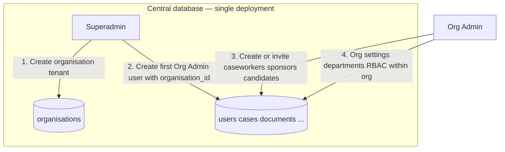

# EPiC API — Backend Analysis and Multi-Tenant Feasibility

**Document purpose:** High-level technical analysis of the `EPiC_API` codebase; whether a single-client deployment can evolve into a **multi-tenant** system; **five-role** model (superadmin vs tenant roles); **target flow** (superadmin creates organisations and tenant admin); **current auth flow**; and **adding a second organisation** safely.

**Stack (from `package.json` and source):**

| Layer | Technology |
|--------|------------|
| Runtime | Node.js (ES modules: `"type": "module"`) |
| HTTP | Express 5 |
| ORM / DB | Sequelize 6, PostgreSQL (`pg`) |
| Auth | JWT (`jsonwebtoken`), bcrypt, optional 2FA (`speakeasy`, `qrcode`) |
| Real-time | Socket.IO |
| Files | `multer`, static `/uploads` |
| Other | Stripe, Nodemailer, PDF (`pdfmake`), XLSX, Archiver, PM2 |

---

## 1. Application Entry and Lifecycle

### `src/server.js`

- Loads environment via `dotenv`.
- Imports `app` from `app.js` and the Sequelize instance from `models/index.js`.
- On successful DB connection: runs `sequelize.sync()`, explicitly syncs `Case` with `{ alter: true }`, seeds roles/admin/permissions, initializes application field settings.
- Creates an HTTP server, attaches **Socket.IO** (`initSocketIO`), listens on `PORT` (default `5000`).

**Implication:** Schema changes are partly driven by `sync`/`alter` in development-style flows; production should rely on controlled migrations for multi-tenant schema evolution.

### `src/app.js`

- Configures **CORS** from `getFrontendOrigins()` (comma-separated `FRONTEND_URL`).
- Stripe webhook route uses **raw** body (`express.raw`) before JSON parser — correct for signature verification.
- Mounts a large set of route prefixes under `/api/...` for **auth**, **user**, **admin**, **caseworker**, **sponsors**, **business** (sponsor panel), **candidate**, **cases**, **messages**, **reports**, **superadmin**, etc.
- Global 404 for `/api` and a JSON error handler.

**Implication:** The API is a **monolithic Express app** with domain routes grouped by role/panel, not by tenant.

---

## 2. Configuration

### `src/config/config.js`

- Single database per environment (`development`, `test`, `production`): one host, one database name, one user — typical **single-tenant or shared-database-multi-tenant** host, not “database per tenant” unless you change connection logic.

### `src/config/frontendOrigins.js`

- Allows multiple **origins** for one deployment (e.g. multiple dev ports). That is **not** the same as multi-tenant data isolation; it only affects CORS/Socket.IO browser access.

---

## 3. Data Model and Associations

### Central registry: `src/models/index.js`

- One Sequelize instance, all models registered, extensive **associations** between `User`, `Role`, `Case`, documents, payments, timeline, tasks, messaging, notifications, licences, appointments, etc.
- **`Organisation`** exists and is associated with:
  - `User` (`organisation_id`, nullable — comment in model notes superadmins may have no org)
  - `Case`
  - `SponsorProfile`
  - `AuditLog`
  - `CandidateApplication`

**Important:** Many other entities (e.g. `Document`, `Task`, `Message`, `Conversation`, `Notification`, settings tables) are tied to **users** or **cases** but may **not** carry `organisation_id` directly. Tenant isolation can still be enforced **via** `Case` / `User` joins, but only if every query path is audited.

---

## 4. Authentication and Authorization

### `src/middlewares/auth.middleware.js`

- Verifies JWT with `JWT_SECRET`.
- Sets `req.user = decoded` with payload described in comments as: `{ userId, email, role_id, role_name }`.
- **No `organisation_id` (or tenant slug) in the token** in this middleware.

### `src/middlewares/isSuperAdmin.js`

- Used for `/api/superadmin` routes (superadmin-only).

### `src/routes/superadmin.routes.js`

- Organisation list/create/update and platform analytics/billing routes are **scaffold placeholders** (static JSON responses), not full CRUD against the database yet.

**Conclusion for tenancy:** The **data model begins to describe organisations**, but the **request path does not consistently scope reads/writes by organisation**. A repository-wide search shows `organisation_id` appears in **models only**, not in controllers — so the running app behaves as **single logical customer** (one global dataset), unless something else sets org IDs outside this grep’s scope.

---

## 5. Major Functional Areas (Route Map)

From `app.js`, the API roughly covers:

- **Authentication & users:** `/api/auth`, `/api/user`
- **Admin:** dashboard, workload, candidates, document checklists, licences, RBAC, audit logs, settings, reporting
- **Caseworker:** cases, documents, notes, sponsors, audit, licence, timeline, performance, reschedule
- **Sponsor:** `/api/sponsors`, `/api/business` (sponsor panel routes)
- **Candidate:** `/api/candidate`
- **Shared case domain:** cases, case details, case notes, tasks, documents, notifications, messages, escalations, appointments, Teams/Microsoft integrations
- **Superadmin:** `/api/superadmin` (scaffold)

This matches a **case management / immigration-style** workflow with multiple **roles** (admin, caseworker, sponsor, candidate), which is **orthogonal** to **multi-tenant** (multiple law firms / agencies on one platform).

---

## 6. Real-Time Layer

### `src/realtime/socketServer.js`

- Socket.IO with CORS aligned to frontend origins.
- JWT from handshake (auth, query, headers); attaches `socket.user = decoded`.
- Room logic is in `messagingRealtime.js` / `ioRegistry.js` (not fully expanded in this document).

**Multi-tenant note:** Rooms and emissions should include a **tenant dimension** (e.g. `org:{id}:...`) so one tenant’s events never leak to another’s sockets.

---

## 7. External Integrations (Operational Concern for Tenants)

- **Stripe:** Webhooks and payments — each tenant may need separate Stripe Connect accounts or at least separate webhook secrets and metadata scoping.
- **Email:** Single transporter configuration — per-tenant branding, domains, and quotas are typical requirements.
- **Microsoft / Teams:** OAuth apps and calendars are often **per-tenant** in SaaS.

These are **solvable** but add configuration and admin UI work per organisation.

---

## 8. Is Multi-Tenant Possible?

**Yes. It is absolutely possible** to evolve this backend into a multi-tenant system. The codebase already includes an **`Organisation` model** and **`organisation_id`** on several core tables, which is a common first step toward **shared-database, shared-schema** multi-tenancy.

What you have today is best described as:

- **Multi-role, single-tenant (or implicit single organisation):** many user types, one global data space.
- **Not yet multi-tenant at the application layer:** controllers and JWT do not show systematic enforcement of `organisation_id`.

---

## 9. Common Multi-Tenant Patterns (and Fit for EPiC)

| Pattern | Description | Fit |
|--------|-------------|-----|
| **A. Shared DB, tenant column** | Every (or almost every) business row has `organisation_id`; every query filters by it. | **Best fit** given existing columns. Moderate refactor across controllers/services. |
| **B. Schema per tenant** | One DB, PostgreSQL schema per tenant; search_path or connection per request. | Possible; more ops complexity; Sequelize can be awkward. |
| **C. Database per tenant** | Connection string per tenant; strongest isolation; higher cost and migration complexity. | Possible for enterprise; large change to `models/index.js` and deployment. |
| **D. Separate deployments per client** | One instance + one DB per customer (what you may have now). | “Multi-tenant” product-wise no; hosting-wise multiple singles. |

For most SaaS products like this, **Pattern A** is the pragmatic path: extend `organisation_id` where needed, enforce it in middleware, and add DB constraints (indexes, composite unique keys where appropriate).

---

## 10. What Would Need to Change (High Level)

1. **Tenant resolution**
   - Put `organisation_id` (and optionally org slug) in the **JWT** after login, or resolve org from the user record on every request.
   - Superadmin paths must **bypass** or **explicitly select** tenant.

2. **Middleware**
   - After `verifyToken`, attach `req.tenant` / `req.organisationId` and reject if user’s org is suspended or missing (for non–super-admin roles).

3. **Every data access path**
   - All `findAll` / `findOne` / `create` / `update` / `destroy` must include tenant scope (direct `where: { organisation_id }` or joins through `Case` / `User` that belong to the org).
   - **Highest risk:** reporting, raw SQL, exports, search, and admin “list all” endpoints.

4. **Uniqueness**
   - Today `User.email` is globally unique. For multi-tenant SaaS, you often want **unique per organisation** (composite unique on `(organisation_id, email)`), which is a **breaking schema/design** decision if the same person could exist in two orgs.

5. **Case IDs and counters**
   - `caseId` strings like `CAS-000001` may need to be **per-tenant** or include a tenant prefix to avoid collisions and confusion.

6. **Files**
   - `/uploads` should be namespaced by `organisation_id` (or equivalent) on disk or in object storage.

7. **Socket.IO**
   - Namespace or room naming per tenant; authorize subscriptions against case/org membership.

8. **Seeders and superadmin**
   - Implement real **organisation CRUD** and user provisioning under `superadmin` routes; first org bootstrap flow.

9. **Frontend**
   - Not part of this repo’s analysis, but the client must send nothing that overrides tenant id; server must be authoritative.

**Effort:** This is a **cross-cutting migration**, not a small patch. The schema head start (`Organisation`, foreign keys) reduces risk compared to a greenfield project, but **behavioral** isolation is the bulk of the work.

---

## 11. Summary

| Question | Answer |
|----------|--------|
| Can this become multi-tenant? | **Yes.** |
| Is it multi-tenant today? | **Largely no** at the API/query layer; **partially prepared** in the database model (`Organisation`, `organisation_id` on several entities). |
| Recommended direction | **Shared database + `organisation_id`** everywhere it matters, JWT + middleware enforcement, then harden reporting, files, sockets, and third-party integrations per tenant. |

---

## 12. Five Roles: Platform vs Tenant

Roles are defined in `src/middlewares/role.middleware.js` (`ROLES`) and seeded in `src/seeders/role.seeder.js`.

| `role_id` | Role name | Scope |
|-----------|-----------|--------|
| 5 | **superadmin** | **Platform** — manages organisations across the central database; typically **no** `organisation_id` (or null). |
| 3 | **admin** | **Tenant (organisation)** — org administrator; must have **`organisation_id`**. |
| 2 | **caseworker** | Same organisation as their admin; **`organisation_id`** on user (or equivalent scoping). |
| 4 | **business** | Sponsor/business user; same **`organisation_id`**. |
| 1 | **candidate** | Candidate user; should be scoped to one org via **`organisation_id`** on user and/or via **case → organisation** (product choice). |

**Principle:** **Superadmin** answers “which organisations exist on the platform?” **Admin / caseworker / business / candidate** answer “what can I do **inside my organisation**?” Roles and tenants stack: **tenant + role**, not role instead of tenant.

---

## 13. Target Flow: Central DB, Superadmin Creates Organisations, Tenant Admin Onboards Users

This is the **intended** multi-tenant operating model for one deployment and one PostgreSQL database.

### Step-by-step (narrative)

1. **Superadmin** authenticates against the same API; JWT carries **`role_id: 5`** and **no tenant** (or `organisation_id: null`). Routes under `/api/superadmin` perform **cross-tenant** operations (organisation CRUD, billing, global audit — to be implemented beyond current scaffold).
2. **Create organisation:** insert into `organisations` (name, slug, plan, status, etc.). That row’s `id` is the **tenant key**.
3. **Create first tenant admin:** insert `users` with **`role_id = 3` (admin)** and **`organisation_id`** = the new organisation. Send credentials or invite link.
4. **Org admin** logs in; JWT must include **`organisation_id`** for every tenant-scoped route.
5. **Org admin** creates **caseworkers**, **business** users, and onboarding for **candidates** — all with the **same `organisation_id`** (or strict derivation from cases belonging to that org).
6. **All business queries** for roles 1–4 filter by **`organisation_id`** from JWT (or from `User` joined with the token’s `userId`). **Superadmin** queries either omit the filter (platform lists) or **explicitly** pass an organisation when acting on one tenant.

---

## 14. JWT Payload Shapes (Target)

**Superadmin (platform)**

- `userId`, `email`, `role_id: 5`, `role_name: "superadmin"`
- `organisation_id`: **omit or `null`** — middleware must **not** apply tenant filters on superadmin routes unless an org is explicitly selected in the URL/body.

**Tenant users (admin, caseworker, business, candidate)**

- `userId`, `email`, `role_id`, `role_name`
- **`organisation_id`:** required integer for normal `/api/admin`, `/api/caseworker`, `/api/business`, `/api/candidate` flows (reject login or reject API if org missing/suspended).

**Today (as implemented):** login and `verify-otp` issue JWT with `userId`, `email`, `role_id`, `role_name` only — see `src/controllers/auth.controller.js`. Adding `organisation_id` is a required implementation step for tenant isolation.

---

## 15. Current Auth and Route Flow (As Implemented)

- **Register:** `POST /api/auth/register` → unverified user + OTP email; **`role_id`** allowed **1–4** in register handler.
- **Verify OTP:** `POST /api/auth/verify-otp` → creates `User`, returns JWT (same payload shape as login).
- **Login:** `POST /api/auth/login` → JWT **7d**; optional **2FA** branch before token.
- **Authenticated requests:** `verifyToken` sets `req.user` from JWT; routes add `checkRole` and/or `checkPermission` from `src/middlewares/role.middleware.js`.
- **Candidate panel:** `/api/candidate/*` — `verifyToken` + `requireCandidate` (role 1 only).
- **Business panel:** `/api/business/*` — `verifyToken` + `checkRole([BUSINESS])`.
- **Superadmin:** `/api/superadmin/*` — `verifyToken` + `isSuperAdmin`; organisation endpoints are currently **scaffold** responses in `src/routes/superadmin.routes.js`.

This flow is **role-first**; **tenant-first** enforcement is the gap to close for multi-organisation production use.

---

## 16. Registration and Invites (Security)

- **Do not** let public `register` accept a raw `organisation_id` from the client without verification — users could attach themselves to any tenant.
- **Preferred patterns:**
  - **Invite token** (signed) containing `organisation_id` + allowed `role_id`, consumed once at registration; or
  - **Superadmin / org admin** creates users server-side and sends reset/set-password email.

Align `UnverifiedUser` / registration payloads with whichever pattern you choose.

---

## 17. Adding a Second Organisation (e.g. EPiC + Another Customer)

- **Not sufficient:** only inserting a second row in `organisations` while controllers ignore `organisation_id` — risk of **mixed data** or **cross-tenant reads**.
- **Sufficient path:** (1) create organisation row; (2) assign **every** user and case for that customer **`organisation_id`**; (3) put **`organisation_id` in JWT**; (4) **middleware + queries** enforce it on all tenant routes; (5) implement **real** superadmin org CRUD in `superadmin.routes.js` (replace scaffold).

Until then, a second organisation in the database is a **label**, not a **boundary**.

---

## 18. Roles × Tenant (Quick Reference)

| User type | Sees |
|-----------|------|
| Superadmin | All organisations (when implemented); platform operations. |
| Admin | Only their **`organisation_id`** — users, settings, reports for that org. |
| Caseworker | Cases and work items for that org only. |
| Business | Sponsor/case views for that org only. |
| Candidate | Own cases/applications belonging to that org only. |

---

*Generated from repository structure and representative source files (`server.js`, `app.js`, `models/index.js`, `auth.middleware.js`, `superadmin.routes.js`, `role.middleware.js`, `role.seeder.js`, `auth.controller.js`, `config`, models). Sections 12–18 describe the **target** multi-tenant role flow alongside **current** behaviour. For line-accurate references, open those files in the IDE.*
